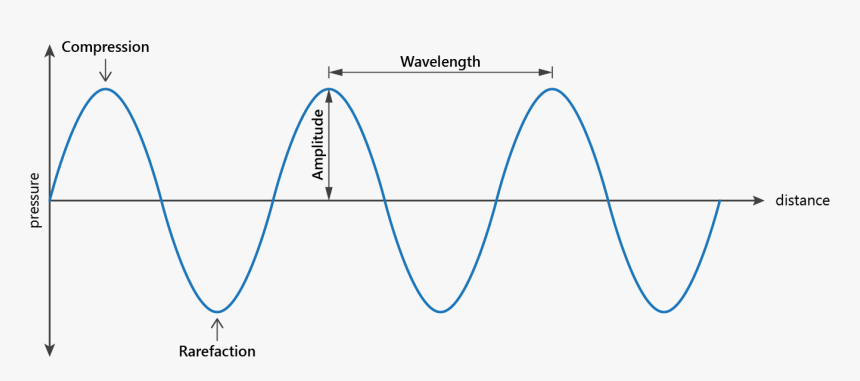
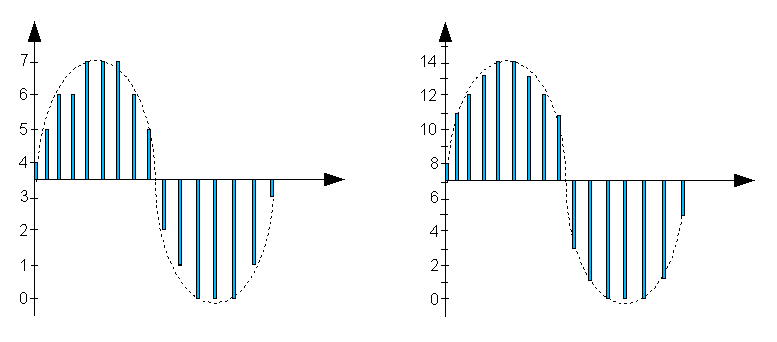
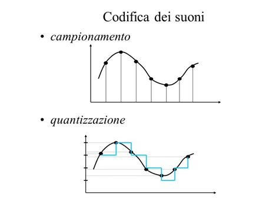

# Rappresentazione delle informazioni multimediali
- **Immagini**
- **Video**
- **Suoni**
- **Simboli alfanumerici**

## 1. Rappresentazione dei simboli alfanumerici
- **Codifica ASCII standard**   
usa 7 bit (il bit più significativo e' zero)  
>Esempio:  
`A <---> 01000001`  
`@ <---> 01000000`  
`a <---> 01100001`

- **Codifica ASCII esteso**  
usa 8 bit (non e' standard)

- **UNICODE**  
usa 16 bit, i primi 128 simboli sono ASCII standard (per biocompatibilità)
>Esempio:  
`A <---> 0000000001000001`

**Esercizio**
il simbolo 0 (zero) ha codifica decimale `48`, qual e' la sua rappresentazione UNICODE?
```
48 = 1100000  
UNICODE = 00000000000110000  
```

## 2. Rappresentazione delle immagini
- **Campionamento** - suddivisione delle immagini in pixel - immagini raster (Pixel = Picture element).  
La risoluzione e' il numero di pixel (Megapixel) che e' numero verticale per numero orizzontale di pixel (1920x1080).

- **Quantizzazione** - quanti bit si utilizzano per rappresentare un pixel.  
Ad esempio:   
La risoluzione dell'immagine precedente e': 6x3  
La quantizzazione e': 1 bit (2 colori)  
Se la rappresentiamo con 0 = nero e con 1 = bianco, quale sequenza di bit otteniamo: `[0 0 1 1 0 0 0 1 1 1 1 0 0 0 0 0 0 0]` (Peso: 18 bit = 3 byte rappresentato).   
Consideriamo 3 tipologie standard di quantizzazione.  
-> 1 bit x pixel (immagini B/N)  
-> 8 bit x pixel (livelli di grigio / colore)  
-> 24 bit x pixel (immagini RGB)  
-> 32 bit x pixel (immagini RGBA [con trasparenza])  
  
  Quanti MB occuperà un'immagine full-HD in true color?  
  >1920x1080 = 2073600 pixel  
  >2073600 x 24 = 49766400 bit = 6220800 byte / 2^20 = 5.93 MB

## 3. Rappresentazione dei video
I video sono semplicemente una sequenza di immagini in rapida "riproduzione".  
L'unica grandezza aggiuntiva riguarda il numero di immagini (frame, fotogrammi) visualizzati in un secondo, ossia FPS.  
Quanti GB occupa un video con fotogrammi in full-hd e true colors della durata di 10 minuti a 25 fps.  

## 4. Rappresentazione dei suoni

### Frequenza
Un unita di misura dei suoni e' la frequenza. La frequenza se e' piu bassa il suono sembra piu' profondo mentre se e' piu alta il suono sembra piu' alto.


### Campionamento
Il campionamento consiste in quanti punti del suono preleviamo ogni secondo.  
Si chiama anche frequenza di campionamento e si misura in hertz (Hz).  
Ogni **campione** ha una sua **intensita'**.



### Quantizzazione
Corrisponde al numero di suddivisioni dell'intensita' del suono. Quindi le informazioni vengono tradotte in modo quantificabile. Generalmente si utilizzano **16 bit** per rappresentare le suddivisioni dell'intensita', ossia 65'536 livelli di intensita'.  
Lo standard CD audio utilizza un campionamento a 44.1 kHz e una quantizzazione a 2 byte/campione.

